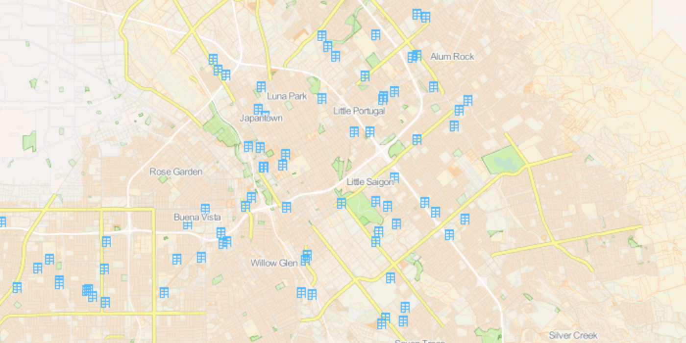

# Improve Overall Cadasta Cartography

A basemap demonstration for the [Cadasta](https://github.com/Cadasta/cadasta-project-ideas/issues/11) Outreachy internship using [TileMill](http://www.mapbox.com/tilemill/) and [CartoCSS](https://github.com/mapbox/carto).

# Approach

Using an [initial map](https://demo.cadasta.org/organizations/any-given-sunday/projects/san-jose-open-data-portal-affordable-housing/) on the [Cadasta](http://cadasta.org/) demo site, I designed a basemap of San José, with all of the most recent affordable, family housing units, according to the [San José Open Data Portal](http://data.sanjoseca.gov/home) as of September, 2016. The shapefiles came from the City of San José's government [data download](http://www.sanjoseca.gov/index.aspx?NID=3308) portal.

Using these tools, I sought to highlight [isolation issues](http://nyti.ms/1JsFoJv) associated with affordable housing, particularly those social, economic, geographic and cultural in form. Mapping the relative proximity of housing units to the cultural, social and economic hubs of a city help to elucidate many impacts of isolation, namely citizen buy-in to regional politics, economic prosperity in the form of job seeking/maintaining and taxing/public funding zoning.

# Map Images

I emphasized the visibility of major roads, making their proximity to the units conspicuous. I deemphasized freeways, highways and roads that are more often frequented by privately-owned passenger vehicles. Bus routes, train stops and other public transportation locations, which spur and/or are cultural, economic and social hubs, exist on major roads and not Interstate, State & US highways, in San José. Main roads are determined by the San Jose/zoning & planning governing bodies. Also emphasized are the parks, bodies of water, riverbanks and waterways near the homes, indicating access to natural recreational hubs/spaces.

# Data Sources
